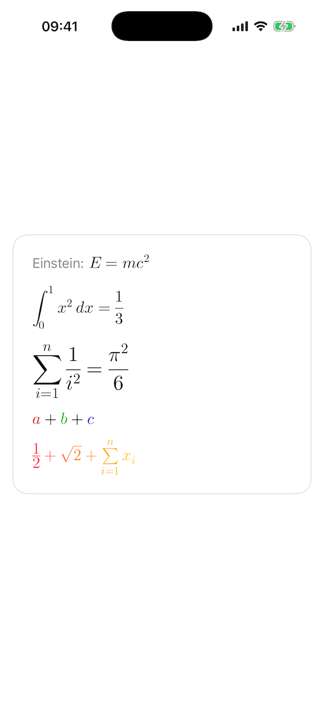

# SwiftUIMath
<!-- TODO: Badges -->
Render LaTeX-style math expressions natively in SwiftUI.

SwiftUIMath provides a small, focused SwiftUI API for displaying mathematical expressions across Apple platforms.

<picture>
  <source media="(prefers-color-scheme: dark)" srcset="./DemoDark.png">
  
</picture>

## Motivation

SwiftUIMath aims to make math expressions feel native in SwiftUI. It provides a small, focused API that renders math
directly and integrates naturally with SwiftUI across Apple platforms.

## Features

- Native SwiftUI `Math` view
- Inline and display math typesetting
- Bundled, high-quality math fonts
- Monochrome rendering (respects `foregroundStyle`)
- Multicolor rendering (honors LaTeX color commands)
- Vector-based, native rendering

## Minimum requirements

You can use SwiftUIMath on the following platforms:

- iOS 17+
- macOS 14+
- tvOS 17+
- watchOS 10+
- visionOS 1.0+

## Getting started

The simplest way to render math is with the `Math` view:

```swift
Math("x^2 + y^2 = z^2")
```

By default, math is rendered in *display style*. You can control the typesetting style using a view modifier:

```swift
Math("\\int_0^1 x^2\\,dx = \\frac{1}{3}")
  .mathTypesettingStyle(.text)

Math("\\frac{1}{2} + \\sqrt{2}")
  .mathTypesettingStyle(.display)
```

## Styling math

SwiftUIMath keeps styling explicit and predictable. There are three main knobs: font, typesetting style, and
rendering mode.

### Fonts

SwiftUIMath ships with a curated set of bundled math fonts, exposed via `Math.Font`.

```swift
Math("\\sum_{i=1}^{n} x_i")
  .mathFont(Math.Font(name: .latinModern, size: 24))
```

You can check [`Font.swift`](./Sources/SwiftUIMath/Font.swift) for the available bundled fonts.

### Rendering mode

SwiftUIMath supports two rendering modes: `monochrome` (the default) and `multicolor`.

In monochrome mode, `Math` respects the surrounding SwiftUI foreground style.

```swift
Math("E = mc^2")
  .foregroundStyle(.blue)
```

This mode is ideal when math should blend naturally with surrounding text.

Multicolor mode honors LaTeX color commands such as `\color` and `\textcolor`. Currently, only hex colors
(e.g. `#RRGGBB`) are supported.

```swift
Math("\\color{#cc0000}{a}+\\color{#00aa00}{b}+\\color{#0000cc}{c}")
  .mathRenderingMode(.multicolor)
```

In multicolor mode:

- Explicit LaTeX colors are preserved
- Uncolored glyphs use a base color (`Color.primary` by default)

## Scope

SwiftUIMath focuses on rendering LaTeX math-mode expressions.

It is designed for displaying mathematical notation in SwiftUI views, not for typesetting full LaTeX documents or
evaluating expressions. While it supports a wide range of common math constructs, not all LaTeX commands are
implemented.

## Installation

You can add SwiftUIMath to an Xcode project by adding it to your project as a package.

> https://github.com/gonzalezreal/swiftui-math

If you want to use SwiftUIMath in a [SwiftPM](https://swift.org/package-manager/) project, it's as
simple as adding it to your `Package.swift`:

``` swift
dependencies: [
  .package(url: "https://github.com/gonzalezreal/swiftui-math", from: "0.1.0")
]
```

And then adding the product to any target that needs access to the library:

```swift
.product(name: "SwiftUIMath", package: "swiftui-math"),
```

## Acknowledgments

SwiftUIMath builds on prior work in native math rendering on Apple platforms:

- [iosMath](https://github.com/kostub/iosMath) laid the groundwork for native math layout and rendering.
- [SwiftMath](https://github.com/mgriebling/SwiftMath) brought these ideas into the Swift ecosystem and inspired
  this project.

This work would not be possible without the contributions of these projects.

## License

This library is released under the MIT license. See [LICENSE](LICENSE) for details.
